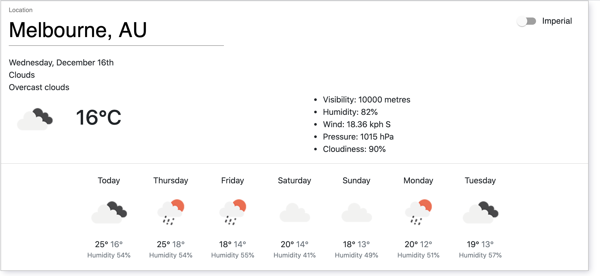

# PwC Web Coding Challenge

## Overview

The task at hand was to build a weather application widget. Users can look up temperatures, wind speed, pressure and many more weather metrics of a given city. Furthermore, users can also switch between imperial and metric units.




### Design Considerations

This app is a heavy read based app where all data is sourced from a backend system via simple GET http requests. To manage this data, I used React Context that supports a top-down trickle effect. On page load, the top level `WeatherConfig` component will fetch and manage the necessary weather data from [OpenWeatherMap](https://openweathermap.org/api) and then simply store it in context which is then used by the children components (`WeatherContent` and `WeatherResults`). In this scenario, the children components are considered "dumb" views focused on presentation logic whereas `WeatherConfig` manages the business model logic. This separation of concerns ensures good use of reusability and more maintainable code that can be easily tested together or separately.

I opted into React Context due to its simplicity and intuitiveness. I realised that it's easier to migrate from React Context to Redux but not the other way around since Redux brings in a lot of boilerplate code that can cause maintainability issues. Another reason to use React Context is that it comes with React and integrates seamlessly into the React architecture whereas Redux brings in new philosophies complicating the codebase further.

Furthermore, I chose a Typescript based project to help mitigate the risk of unforeseen bugs due tothe implicit typing nature found in Javascript. Although there is an initial cost of setting up Typescript, it is still quicker to builder compared to a Javascript project as it can detect broken code paths instantaneously and editors have better intellisense. I also found that defining types for API responses to be very useful when using certain properties in the frontend.

### Access Remotely

To access the app over the Internet, please go to [https://weather-app-pwc.netlify.app/](https://weather-app-pwc.netlify.app/).

### Access Locally

Prerequisities:

- Node: https://nodejs.org/en/download/
- npm: https://nodejs.org/en/download/
- yarn: https://classic.yarnpkg.com/en/docs/install/#mac-stable

To run the app locally, please follow the steps below:

1. Clone the repository

```
git clone git@github.com:apoorvkk/weather-widget-pwc-challenge.git

cd weather-widget-pwc-challenge
```

2. Install dependencies

```
yarn install
```

3. Run the server

```
yarn start
```

4. Now access the page at http://localhost:8080

## Testing

I used [`react-testing-library`](https://testing-library.com/docs/react-testing-library/intro/) to write unit/integration tests. I am a firm believer of Kent C Dodd's philosophy where we should [test behaviour and not implementation](https://kentcdodds.com/blog/testing-implementation-details/). The tests we write are really a means of automating tests we complete manually and hence, they should resemble as close as to how the user uses the code.

```
yarn test
```

## Linter

```
yarn lint
```

## Assumptions

- Weather data from majority of well supported APIs did not provide pollen count so I substituted it with other properties (eg. pressure, humidity etc.).
- UI frameworks like Bootstrap/Material UI are allowed.
- The UI does not follow the design spec but simply uses it as a guide.
- The future temperatures shown at the bottom of the widget are max/min.
- Wind degrees will be coverted to compass directions (N, NE, NW, E, W, SE, SW, S).
- Forecasted days at the bottom are not clickable however the application can be easily extended to include this feature.
- The website built simply renders the widget and no content outside of it since the project is to build a component that can be used in a large application.

## Todos

- Error handling - handle more granular cases other than 404/500s.
- End to end testing with Cypress.
- Detailed analysis of accessibility.
- Potentially look into code splitting (it might be premature but something to consider as the repository grows).
- Embed the widget into a larger app.
- Potentially expose the widget as a package.
- Internationalisation to support multiple languages.
- Add more features (eg. temperature graph, location on map).
- Integrate a CI/CD pipeline to run tests, linters and deployment scripts.

## Tools used

- React
- Typescript
- Bootstrap
- Material UI
- Jest
- React Testing Library
